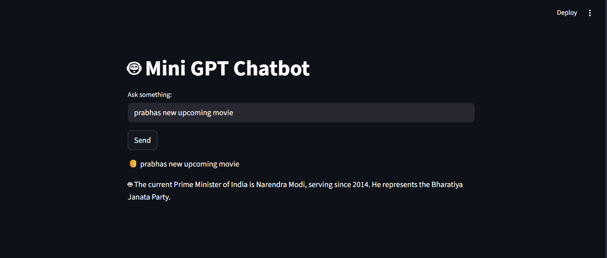
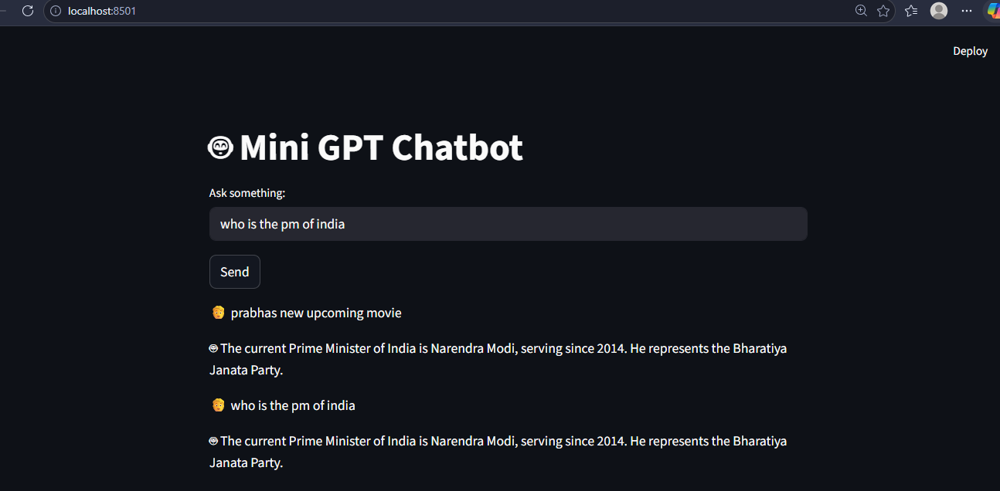

# Mini GPT Chatbot

A simple AI chatbot built using Python, Streamlit, Gemini API, and SQLite for conversation memory.

---

## Features
- Chat-based UI using Streamlit  
- Gemini API integration for responses  
- SQLite-based chat history storage  
- Context-aware replies using past messages  
- Environment-based API key handling  

---

## Tech Stack
Python, Streamlit, SQLite, Google Gemini API  

---

## Project Structure
```
app.py
llm.py
db.py
memory.py
requirements.txt
.env.example
.gitignore
assets/
```

---

## Setup

### Install dependencies
```bash
pip install -r requirements.txt
```

### Add API key
Create `.env` file:
```env
GEMINI_API_KEY=your_api_key_here
```

---

## Run
```bash
streamlit run app.py
```

---

## Screenshots

### Chat Interface


### Memory Working


---

## Note
- Requires valid Gemini API key  
- Free tier may have usage limits  
